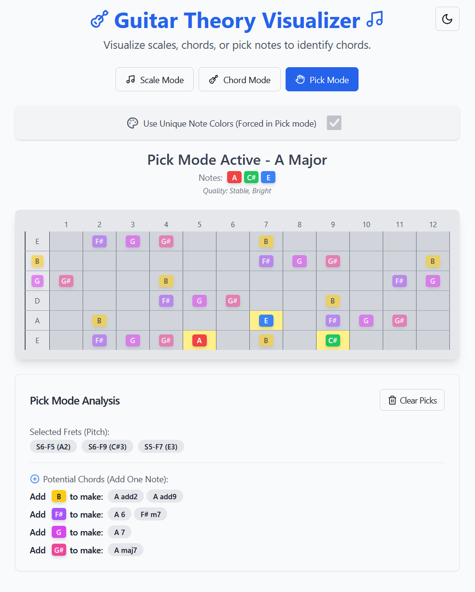

# 🎸 Guitar Theory Visualizer 🎶

Welcome to the Guitar Theory Visualizer! This interactive web application helps guitarists understand music theory concepts like scales, chords, and note relationships directly on a virtual fretboard.

## ✨ Features

*   **Interactive Fretboard**: Visualize notes dynamically.
*   **Mode Selection**:
    *   🎵 **Scale Mode**: Select a root note and a scale type (e.g., Major, Natural Minor, Pentatonic Minor) to see all corresponding notes highlighted on the fretboard.
    *   🎼 **Chord Mode**: Choose a root note and a chord type (e.g., Major, Minor, Dominant 7th) to display the chord's notes.
    *   👆 **Pick Mode**: Click directly on frets to select notes.
        *   Identifies potential chords formed by the selected notes.
        *   Suggests additional notes that could complete common chords.
        *   Shows all available notes when 0 or 1 note is selected for easy exploration.
*   **Root Note Highlighting**: Clearly distinguishes the root note in Scale and Chord modes.
*   **Color Themes**:
    *   🎨 **Standard**: Root notes in blue, other scale/chord notes in green.
    *   🌈 **Unique Notes**: Each of the 12 chromatic notes has its own distinct color for easy identification (forced in Pick Mode).
*   **Customizable Display**:
    *   Standard 6-string guitar tuning (EADGBe).
    *   12 frets displayed with standard fret markers.
*   **Deep Linking 🔗**: Share specific configurations! The app's state (mode, selected key, scale/chord, picked notes) is reflected in the URL, allowing you to bookmark or share exact visualizations.
*   **Responsive Design**: Adapts to different screen sizes (though primarily designed for desktop).
*   **Dark/Light Mode 🌓**: Toggle between dark and light themes for comfortable viewing.

## 📝 License

This project is licensed under the ISC License - see the `LICENSE` file for details (if you have one, otherwise state "ISC License" or your chosen license).

---

Happy visualizing and rock on! 🤘
